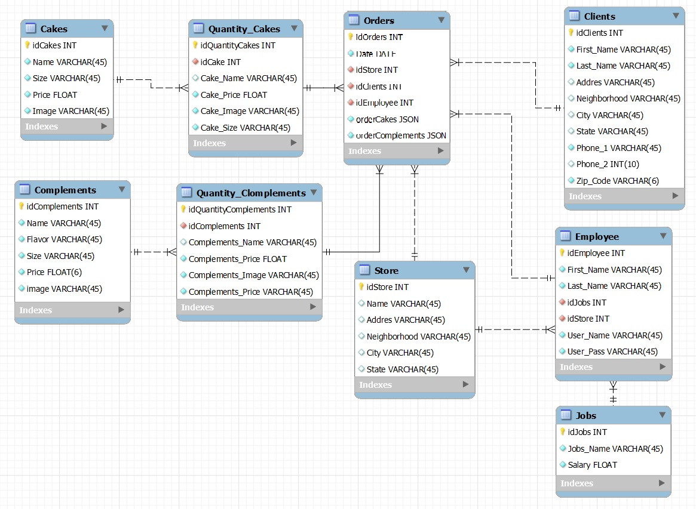

# Pastelería Bedu
### Proyecto Final de Módulo Backend Fundamentals

Introducción:
Proyecto de una pastelería donde se trabajaron 5 áreas: 
1. <a href="bacjend" >Backend con Node.js y API Rest con Express.js</a>
2. <a href="postgresql" >Base de datos con PostgreSQL.</a>
3. <a href="design" >Diseño UX/UI de la Interfaz de Usuario </a>
4. <a href="frontend" >Diseño Frontend de la aplicación web.</a>
5. <a href="ml" >Sistema de recomendaciones con Machine Learning y Python.</a>

<section id="backend">
  <h3>1. Backend con Node.js y API Rest con Express.js</h3>
  
Se trabajo todo lo aprendido en clase para levantar un servidor donde se estructuro una API rest para la pastelería, donde se crearon los siguientes archivos:

  
  <ul>
    <li>Routes <ul>
        <li>Cakes.Routes: </li>
        <li>Complements.Routes: </li>
      </ul>
    </li>
    <li>Services <ul>
        <li>Cake.Service: </li>
        <li>Complemnets.Service: </li>
      </ul>
    </li>
    <li>Middlewares <ul>
      <li></li>
      </ul>
    </li>
    <li>Schemas <ul>
      <li></li>
      </ul>
    </li>
  </ul>
</section>
  
<section id="postgresql">
  <h3>2. Base de datos con PostgreSQL.</h3>  
  
Para la experiencia y diseño del usuario se siguio una métodologia Design Thinkin.

  
</section>

<section id="design">
  <h3>3. Diseño UX/UI de la Interfaz de Usuario</h3>
  
Para la experiencia y diseño del usuario se siguio una métodologia Design Thinkin.

  <a href='./design/' >Proceso de Diseño</a>
 </section>
 
<section id="frontend">
  <h3>4. Diseño Frontend de la aplicación web.</h3>  
</section>

<section id="ml">
  <h3>5. Sistema de recomendaciones con Machine Learning y Python.</h3>  
</section>
