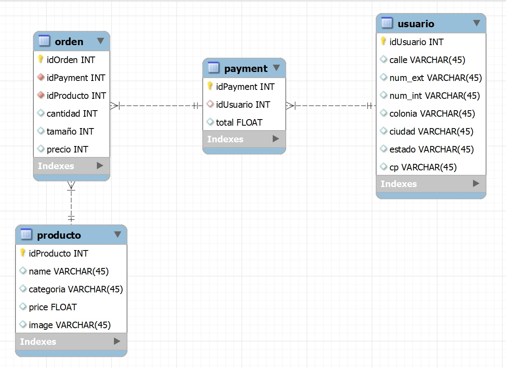
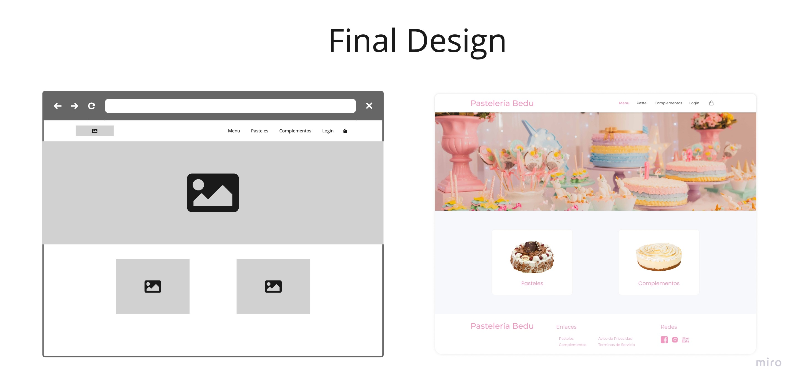

# Pastelería Bedu
### Proyecto Final de Módulo Backend Fundamentals

Introducción:
Proyecto de una pastelería donde se trabajaron 5 áreas: 
* Backend con Node.js y API Rest con Express.js
* Base de datos con PostgreSQL.
* Diseño UX/UI de la Interfaz de Usuario.
* Diseño Frontend de la aplicación web.
* Sistema de recomendaciones con Machine Learning y Python.

<section>
  <h3>1. Problem statement</h3>
  
Para el desarrollo de nuestra aplicación, se empezo realizando una hipotesis sobre los posbiles Pains de nuestros Stakeholders.

  
Se realico investigación de Usuario para encontrar insights.

  
Si te interesa, puedes sequir seguir todo el <a href='./design/' >proceso de diseño aqui</a>

</section>

<section id="backend">
  <h3>1. Backend con Node.js y API Rest con Express.js</h3>
  
Se trabajo todo lo aprendido en clase para levantar un servidor donde se estructuro una API rest para la pastelería, donde se crearon los siguientes archivos:

  
  <ul>
    <li>Routes <ul>
        <li>Products.Routes</li>
        <li>Orders.Routes</li>
      </ul>
    </li>
    <li>Services <ul>
        <li>Products.Service: </li>
        <li>Orders.Service</li>
      </ul>
    </li>
    <li>Middlewares <ul>
      <li>@hapi/boom</li>
      <li>Joi<li>
      </ul>
    </li>
    <li>Schemas<ul>
      <li>Products.Schema</li>
      <li>Orders.Schema</li>
      </ul>
    </li>
    <li>Models<ul>
      <li>Products.Model</li>
      <li>Orders.Model</li>
      </ul>
    </li>
  </ul>
</section>
  
<section id="one">
  <h3>2. Base de datos con PostgreSQL.</h3>  
  
Para la experiencia y diseño del usuario se siguio una métodologia Design Thinkin.

   
</section>

<section id="design">
  <h3>3. Diseño UX/UI de la Interfaz de Usuario</h3>
  
Para la experiencia y diseño del usuario se siguio una métodologia Design Thinkin.

  <a href='./design/' >Proceso de Diseño</a>
   
 </section>
 
<section id="frontend">
  <h3>4. Diseño Frontend de la aplicación web.</h3>  
</section>

<section id="ml">
  <h3>5. Sistema de recomendaciones con Machine Learning y Python.</h3>  
</section>
