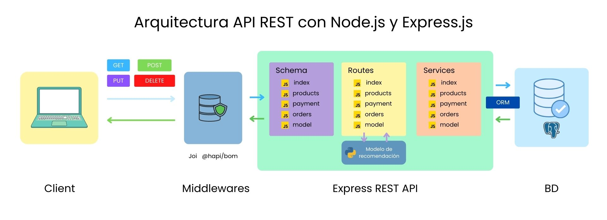

# Pastelería Bedu
### Proyecto Final de Módulo Backend Fundamentals

Introducción:
Proyecto de una pastelería donde se trabajaron 5 áreas: 
* Backend con Node.js y API Rest con Express.js
* Base de datos con PostgreSQL.
* Diseño UX/UI de la Interfaz de Usuario.
* Diseño Frontend de la aplicación web.
* Sistema de recomendaciones con Machine Learning y Python.

<section>
  <h3>1. Problem Statement</h3>
  
Para el desarrollo de nuestra aplicación, se empezo con una hipotesis sobre los posibles Pains de nuestros Stakeholders.

  
Se realizó investigación de Usuario para encontrar insights para trabajarlo en nuestra aplicación.

  
Si te interesa, puedes sequir seguir todo el <a href='./design/' >proceso de diseño aqui</a>.

  
Esta investigación nos ayudo a encontrar cual seria el flujo de nuestra aplicación.
 
   
</section>

<section id="backend">
  <h3>2. Desarrollo de Backend con Node.js y API Rest con Express.js</h3>
  
Se trabajo todo lo aprendido en clase para levantar un servidor donde se estructuró una API rest para la pastelería.

  
Se empezo trabajando con las principales routas que tendriamos para la aplicación. Se mantuvo la ideología de una Clean Architecture al crear una capa de servicios de cada uno de nuestros enpoints.

  
Despues se incorporaron middlawares para espuesta de servidor, así como para validar los datos de entrada.

  
Se incorporo un ORM para el manejo de la base de datos y se levanto un contenedor en PostgreSQL

   
</section>
  
<section id="one">
  <h3>4. Base de datos con PostgreSQL.</h3>  
  
Teniendo ya las rutas para las peticiones de datos, se trabajo en el ORM para diseñar las tablas donde estarian nuestros datos.

  
Se diseñaron las siguientes tablas:

   
</section>

<section id="design">
  <h3>5. UI de la Interfaz de Usuario</h3>
  
Ya teniendo la arquitectura completa de nuestra API, se procedio a realizar el Diseño UI de nuestra aplicación. 

  
De los Wireframes de baja fidelidad que se realizarón en el proceso de diseño, se continuo contruyendo un Moodboard para hacer el diseño de una Pastelería

  <a href='./design/' >Proceso de Diseño</a>
   
 </section>
 
<section id="frontend">
  <h3>4. Diseño Frontend de la aplicación web.</h3>  
</section>

<section id="ml">
  <h3>5. Sistema de recomendaciones con Machine Learning y Python.</h3>  
</section>
