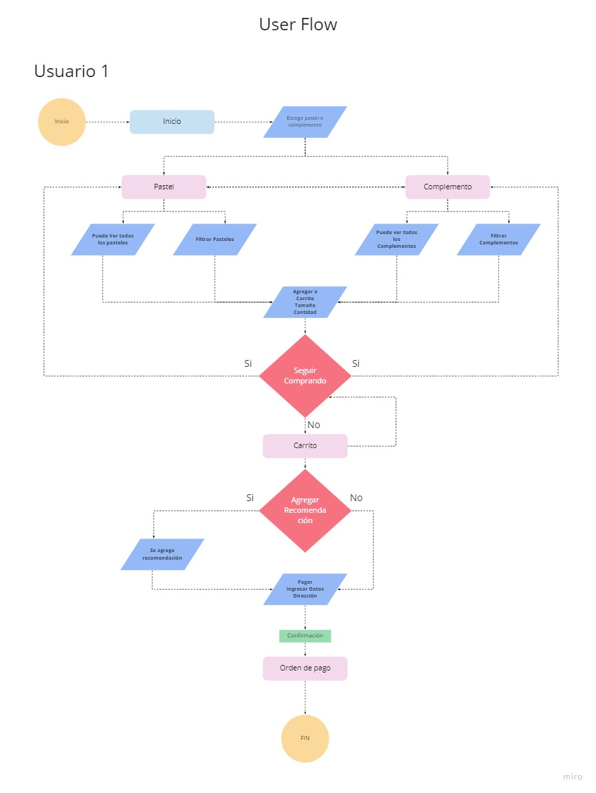
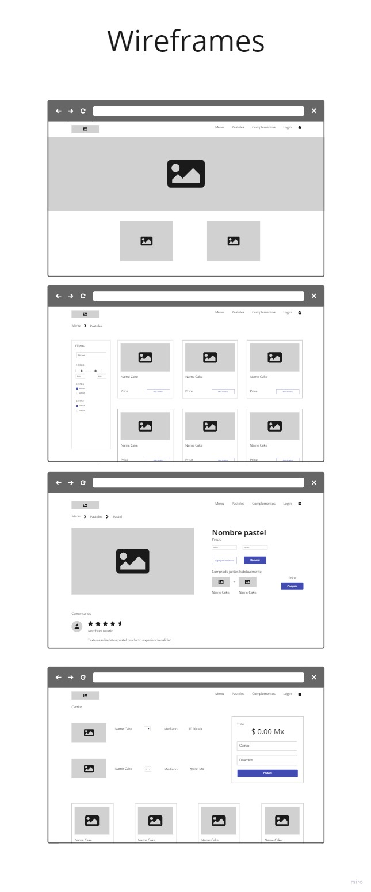

# Proceso de diseño

Este archivo se explicara como se llevo acabo todo el proceso tomando una métodologia Design Thinking para iterar sobre nuestro proyecto.

Contenido:

1. <a href='#survey'>Encuesta a Usuarios</a>
2. User Persona
3. <a href='#jorney'>User Jorney</a>
4. <a href='#architecture'>Arquitectura de la información</a>
5. <a href='#user'>User Flow</a>
6. <a href='#low'>Wireframe de Baja Fidelidad</a>
7. Moodboard
8. Wireframe de Alta Fidelidad

<section id='surveys' >
  <h3>1. Encuesta a Usuarios</h3>
  
Se realizo una encuesta para conocer las necesidades de los usuarios en el proceso de la compra de pasteles. 

  
</section>
<section id='jorneys' >
  <h3>3. User Jorney</h3>
  
Se mapeo el proceso que tiene un usuario a la hora de comprar/elegir un pastel, ubicando los puntos en los que estariamos mejorando la experiencia de usuario.

  
</section>
<section id='jorneys' >
  <h3>4. Arquitectura de la información</h3>
  
Se categorizo como estaria dividio nuestra página web dependiendo de la información accesible.

  
</section>
<section id='user' >
  <h3>5. User Flow</h3>
  
Se diseño el flujo de datos, proceso y tecnologías que se utiliziarian para la aplicación.

  
</section>
<section id='low' >
  <h3>6. Wireframe de Baja Fidelidad</h3>
  
Se fue diseñado la interfaz de baja fidelaidad cumpliendo con los requerimientos de usuario según el user flow.

  
</section>

